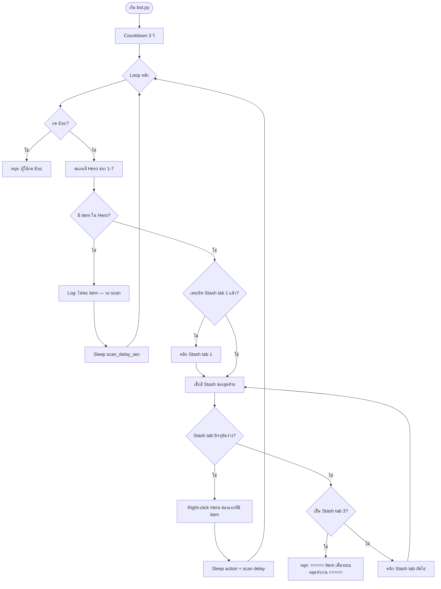

# Flow การทำงานและเงื่อนไข — TaskBarHero Bot

เอกสารนี้ใช้ตรวจสอบว่าบอททำงานตรงตาม spec ปัจจุบัน (color-based)

---

## 1. ข้อมูลที่ Calibrate เก็บไว้

| ข้อมูล | จำนวน | ใช้ทำอะไร |
|--------|-------|-----------|
| `hero_slots` | 7 จุด (ช่อง 1–7) | ตำแหน่งคลิก right-click + จุดสุ่มสี Hero |
| `stash_last_slot` | 1 จุด | จุดสุ่มสีเช็ก Stash เต็ม |
| `stash_tabs` | 3 จุด (tab 1–3) | คลิกสลับแท็บ Stash |
| `empty_slot_color` | RGB 1 ค่า | สีอ้างอิงของ **ช่องว่าง** |
| `color_tolerance` | ตัวเลข (default 15) | ระยะห่างสีที่ยังถือว่า "ว่าง" |
| `sample_size` | px (default 5) | ขนาดพื้นที่เฉลี่ยสีรอบจุดกลาง |

---

## 2. สูตรตัดสินใจ (Detection)

```
color_distance = √((R₁-R₂)² + (G₁-G₂)² + (B₁-B₂)²)

ช่องว่าง   ⟺  color_distance ≤ color_tolerance
มี item    ⟺  color_distance > color_tolerance   (เฉพาะ Hero)
Stash เต็ม ⟺  สีช่องสุดท้าย: color_distance > color_tolerance
```

---

## 3. Flow หลัก (Main Loop)



---

## 4. เงื่อนไขทีละขั้น

### 4.1 ก่อนเริ่ม (Startup)

| # | เงื่อนไข | ผลลัพธ์ |
|---|----------|---------|
| S1 | ไม่มี `config.json` | หยุดทันที, แจ้งให้ calibrate |
| S2 | `hero_slots` ≠ 7 ช่อง | Error, ไม่เริ่ม |
| S3 | `stash_tabs` ≠ 3 แท็บ | Error, ไม่เริ่ม |
| S4 | พิกัดยังเป็น (0,0) | Error, ไม่เริ่ม |

### 4.2 สแกน Hero (ทุกรอบ)

| # | เงื่อนไข | การกระทำ |
|---|----------|----------|
| H1 | สcan Hero ช่อง 1–7 ทุกช่อง | อ่านสีที่พิกัด calibrate |
| H2 | ทุกช่อง: `dist ≤ tolerance` | **ไม่มี item** → ไป H4 |
| H3 | อย่างน้อย 1 ช่อง: `dist > tolerance` | **มี item** → ไป M1 |
| H4 | ไม่มี item | Log + sleep → **วน loop ใหม่** |
| H5 | ไม่มี item | **ไม่คลิก Stash**, **ไม่หยุด** |

### 4.3 เมื่อมี item ใน Hero

| # | เงื่อนไข | การกระทำ |
|---|----------|----------|
| M1 | ครั้งแรกที่เจอ item | คลิก **Stash tab 1** |
| M2 | เช็กสี `stash_last_slot` บน tab ปัจจุบัน | อ่านสีช่องสุดท้าย |
| M3 | `dist ≤ tolerance` | Stash **มีที่ว่าง** → right-click item |
| M4 | `dist > tolerance` | Stash **เต็ม** → ไป M5 |
| M5 | tab ปัจจุบัน < 3 | คลิก tab ถัดไป → กลับ M2 |
| M6 | tab ปัจจุบัน = 3 และเต็ม | **หยุดอัตโนมัติ** |
| M7 | ย้าย item | right-click **ช่องแรก** ที่มี item (col น้อยสุด) |
| M8 | หลังย้าย | sleep แล้ววน loop ใหม่ |

### 4.4 การหยุด (Stop Conditions)

| วิธี | เงื่อนไข | หยุดอัตโนมัติ? |
|------|----------|----------------|
| Stash tab 3 ช่องสุดท้ายเต็ม **ขณะมี item จะย้าย** | `dist > tolerance` บน tab 3 | ใช่ |
| Hero ว่าง | ไม่มี item ทุกช่อง | **ไม่หยุด** |
| กด Esc | ผู้ใช้กด | ไม่ (หยุดด้วยมือ) |
| FAILSAFE | เมาส์มุมซ้ายบนจอ | ไม่ (หยุดด้วยมือ) |
| Ctrl+C | ใน terminal | ไม่ (หยุดด้วยมือ) |

---

## 5. Checklist ทดสอบ (Verification)

### Test A — Hero ว่าง

| ขั้น | ทำ | คาดหวัง |
|------|-----|---------|
| A1 | เปิด STASH+HERO, Hero ว่างทุกช่อง | |
| A2 | รัน `python bot.py` | |
| A3 | ดู log | `"ไม่พบ item ในกระเป๋า Hero — รอ scan..."` |
| A4 | ดู Stash tab | **ยังอยู่ tab เดิม** ไม่กระโดดไป tab 3 |
| A5 | รอ 10 วิ | บอท **ยังรัน** ไม่หยุด |

### Test B — มี item, Stash ว่าง

| ขั้น | ทำ | คาดหวัง |
|------|-----|---------|
| B1 | ใส่ item ใน Hero ช่อง 3 | |
| B2 | Stash tab 1 ช่องสุดท้ายว่าง | |
| B3 | รันบอท | คลิก Stash tab 1 |
| B4 | | right-click Hero ช่อง 3 |
| B5 | | item หายจาก Hero, ไป Stash |

### Test C — Stash tab 1 เต็ม → สลับ tab 2

| ขั้น | ทำ | คาดหวัง |
|------|-----|---------|
| C1 | เติม Stash tab 1 จนช่องสุดท้ายมี item | |
| C2 | มี item ใน Hero | |
| C3 | รันบอท | log `"Stash tab 1 เต็ม"` |
| C4 | | คลิก Stash tab 2 |
| C5 | | ย้าย item ไป tab 2 |

### Test D — Stash tab 3 เต็ม → หยุด

| ขั้น | ทำ | คาดหวัง |
|------|-----|---------|
| D1 | เติม Stash tab 1, 2, 3 จนช่องสุดท้ายเต็มทุก tab | |
| D2 | มี item ใน Hero | |
| D3 | รันบอท | สลับ tab 1→2→3 |
| D4 | | log `" ===== Item เต็มระบบหยุดทำงาน ===== "` |
| D5 | | โปรแกรม **หยุด** |

### Test E — Hero ช่อง 2–7

| ขั้น | ทำ | คาดหวัง |
|------|-----|---------|
| E1 | ใส่ item เฉพาะช่อง 5 | |
| E2 | รันบอท | ตรวจจับช่อง 5 ได้ |
| E3 | | right-click ที่ช่อง 5 |

### Test F — หยุดด้วยมือ

| ขั้น | ทำ | คาดหวัง |
|------|-----|---------|
| F1 | กด Esc ขณะบอทรัน | `"หยุดโดยผู้ใช้ (Esc)"` |
| F2 | ขยับเมาส์มุมซ้ายบน | `"หยุดฉุกเฉิน (FAILSAFE)"` |

---

## 6. Log ที่ควรเห็น (Reference)

```
# Hero ว่าง — รอ
ไม่พบ item ในกระเป๋า Hero — รอ scan...

# Stash มีที่
Stash tab 1 มีที่ว่าง (RGB(45,42,38) ≈ empty RGB(45,42,38), dist=2.0)

# Stash เต็ม — สลับ tab
Stash tab 1 เต็ม (RGB(120,80,60) ≠ empty RGB(45,42,38), dist=85.3)
  → เปลี่ยนไป Stash tab 2
  → คลิก Stash tab 2 ที่ (x, y)

# ย้าย item
Right-click item ใน Hero ช่อง 3 (RGB(120,80,60)) → Stash tab 1

# หยุดอัตโนมัติ
 ===== Item เต็มระบบหยุดทำงาน =====
```

---

## 7. สิ่งที่บอท **ไม่** ทำ

- ไม่สcan Hero ช่อง 8+
- ไม่สcan Stash ทั้ง grid (เช็กเฉพาะช่องสุดท้าย)
- ไม่หยุดเมื่อ Hero ว่าง
- ไม่เปลี่ยน Stash tab เมื่อ Hero ว่าง
- ไม่ย้าย item จาก equipment slots
- ไม่เปิดหน้าต่างเกมให้อัตโนมัติ

---

## English Summary

- **Hero empty:** log, sleep, rescan — never switch stash tabs, never auto-stop.
- **Hero has items:** ensure stash space on current tab; if last slot full, advance tab 1→2→3.
- **Auto-stop:** only when moving items and stash tab 3 last slot is full.
- **Manual stop:** Esc, FAILSAFE (top-left corner), Ctrl+C.
